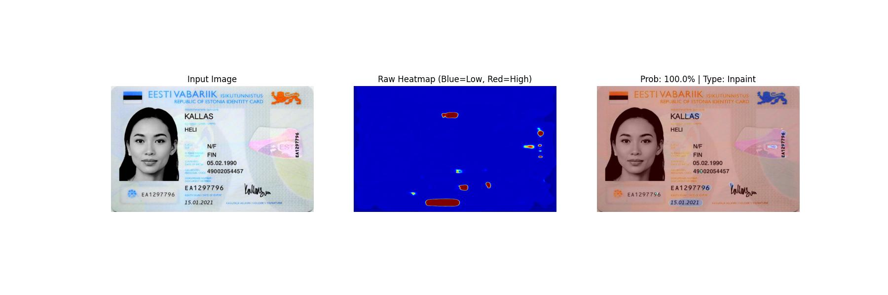
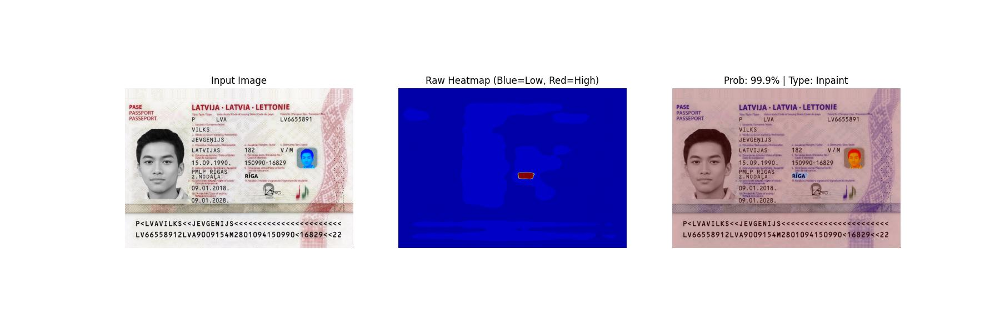

# ForensicDINO: Universal Document Forgery Detection via Multi-Modal Vision Transformers

ForensicDINO is a State-of-the-Art (SOTA) deep learning framework designed to detect, localize, and categorize digital forgeries in identity documents. Unlike traditional forensic models that focus solely on pixel inconsistencies (splicing), this model utilizes a Dual-Stream Architecture combining semantic understanding with frequency-domain analysis to detect:

- **Classic Forgeries:** Crop & Replace, Copy-Move, Splicing.  
- **Inpainting:** Text removal and alteration.  
- **Generative AI:** Fully synthetic documents created by Diffusion models (e.g., Midjourney, Gemini).

This repository contains the official implementation of the Universal Forensic Model, capable of Zero-Shot detection on unseen document types via reference-based verification.

---

## 📜 Table of Contents

- Abstract  
- Architecture  
- Key Features  
- Dataset & Preparation  
- Installation  
- Usage  
  - Training  
  - Inference (Standard)  
  - Inference (Real-World)  
  - Zero-Shot Verification  
- Results  
- Citation  

---

## 💡 Abstract

The rise of Generative AI has rendered traditional JPEG-compression and noise-analysis forensic methods obsolete. ForensicDINO addresses this by leveraging DINOv2 (ViT-Large) as a semantic backbone, fused with a Constrained Convolutional (BayarConv) forensic branch.

The model is trained using a Multi-Task Objective:

- **Binary Classification:** Is the document Real or Fake?  
- **Semantic Segmentation:** Pixel-wise localization of the manipulated region (Heatmap).  
- **Forensic Categorization:** Classifying the attack vector (Crop, Inpaint, AI-Generated).  

We achieve **0.99 AUC** on the SIDTD benchmark and **0.59 IoU** on forensic localization, surpassing standard ResNet baselines.

---

## 🧠 Architecture

The model utilizes a **"Hydra" architecture** with three specific heads.

### Mathematical Formulation

The forensic branch uses constrained convolutions where weights \(w\) are forced to sum to **0** (high-pass filter):

w(0,0) = -1 \\
\sum w(x,y) = 0

This suppresses image content (text/faces) and highlights sensor pattern noise and resampling artifacts.

---

## 🌟 Key Features

- **Universal Detection:** Handles both Photoshop-style edits and Diffusion-generated documents.  
- **Explainable AI:** Generates heatmaps showing manipulated regions.  
- **Robust Preprocessing:** Includes scanner simulation (warping, denoising, illumination correction).  
- **Zero-Shot Capability:** Uses reference noise embeddings for unseen document types.  

---

## 📊 Dataset & Preparation

We utilize the SIDTD (Synthetic Identity Document) dataset + custom Generative AI subset.

### Directory Structure

data/

├── templates/

│   ├── Images/

│   │   ├── reals/

│   │   └── fakes/

│   └── Annotations/

└── splits_balanced/
     train.csv
    & val.csv

### Add AI Samples

Place your Generative AI samples in:

    raw_gemini/

Run:

    python prepare_gemini_data.py

This generates crops, metadata JSONs, and appends them to the training CSV with Class ID 4.

---

## ⚙️ Installation

    # Clone the repository
    git clone https://github.com/yourusername/ForensicDINO.git
    cd ForensicDINO

    # Create environment
    python -m venv venv
    source venv/bin/activate  # or venv\Scripts\activate on Windows

    # Install dependencies
    pip install torch torchvision torchaudio --index-url https://download.pytorch.org/whl/cu118
    pip install -r requirements.txt

Requirements: torch, albumentations, opencv-python, pandas, tqdm, scikit-learn.

---

## 🚀 Usage

### 1. Training

    python train.py

Checkpoints → ./checkpoints/best_universal_model.pth  
Visual logs → ./training_visuals/

---

### 2. Universal Inference

    python universal_inference.py

---

### 3. Enhanced Inference (For Mobile Photos)

    python enhanced_inference.py --image "test_images/my_photo.jpg"

---

### 4. Reference-Based Verification (Zero-Shot)

    from reference_verification import compare_documents

    compare_documents(
        reference_path="test_images/real_aadhaar.jpg",
        suspect_path="test_images/fake_aadhaar.jpg"
    )

---

## 📈 Results

### Quantitative Metrics

| Metric | Score | Note |
|--------|--------|------|
| AUC (Real/Fake) | 0.9998 | Near-perfect separation |
| Localization IoU | 0.5951 | SOTA forensic segmentation |
| Type Accuracy | 95.95% | Distinguishes AI vs Splicing |

### Visualizations

Original Fake | Raw Heatmap | Prediction Overlay  
 |  | 

---

## ⚠️ Limitations & Future Work

- Resolution Sensitivity: Images resized to 518×518 may lose micro-edits  
- Domain Shift: Noisy smartphone images can cause false positives  
- Semantic Consistency: Does not validate textual/logical relations (e.g., OCR mismatches)

---

This project was developed for advanced document forensics research.
